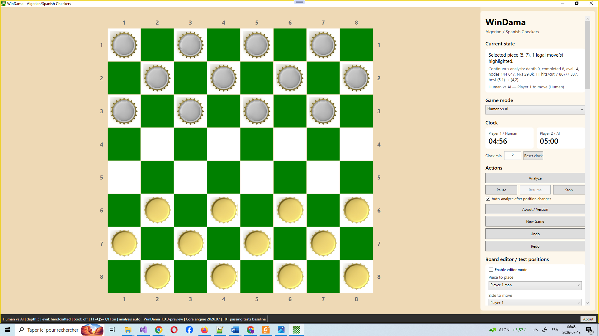
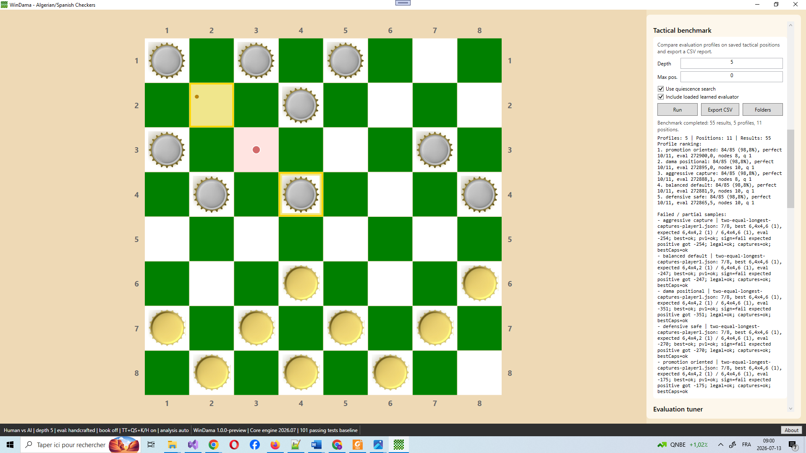
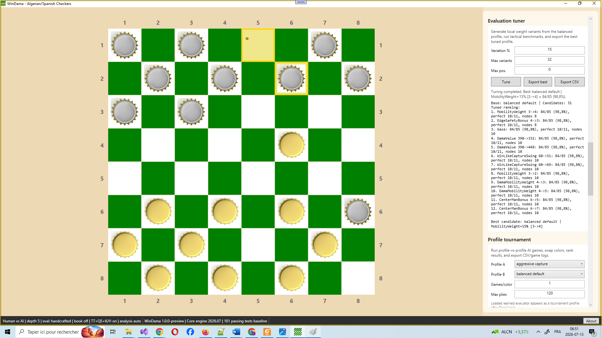
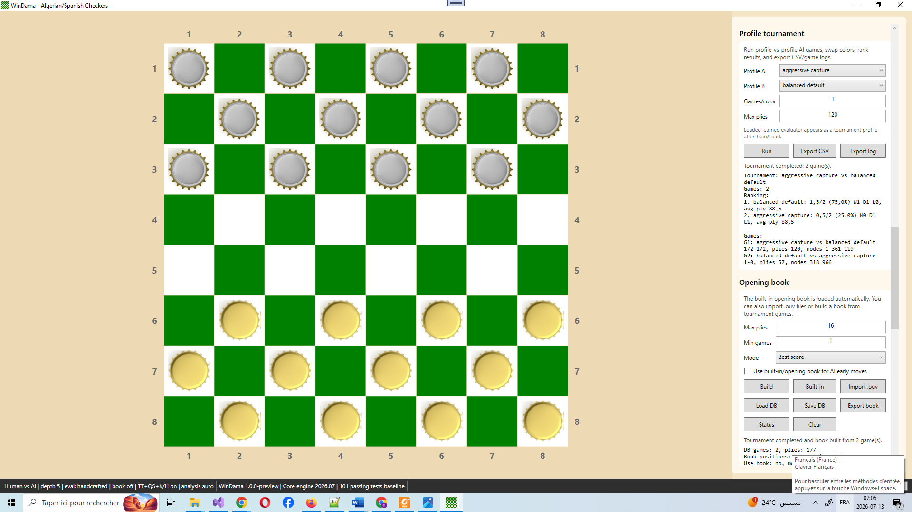
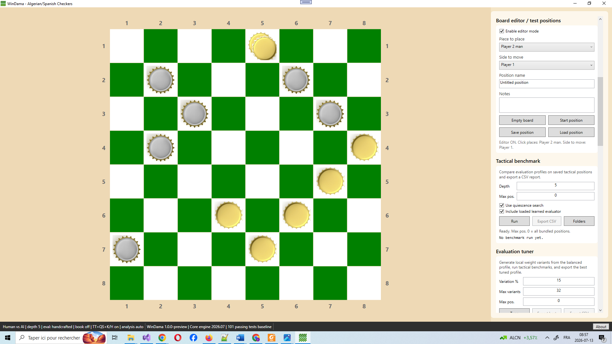

# WinDama — Algerian / Spanish Checkers

[](https://github.com/binarylab2022-del/WinDama/actions/workflows/build.yml)
[](https://github.com/binarylab2022-del/WinDama/actions/workflows/tests.yml)

[](https://github.com/binarylab2022-del/WinDama/releases)
[](LICENSE)


WinDama is an open-source WPF desktop application and engine-development
environment for Algerian / Spanish checkers. It combines a playable graphical
interface, a separate rules engine, AI search, tactical benchmarking,
evaluation tuning, opening-book support, tournament tools, and dataset export.

<p align="center">
  
</p>

## Highlights

- Mandatory capture and longest multi-capture enforcement
- Flying Dama movement and capture rules
- Human vs AI, Human vs Human, and AI vs AI
- Alpha-beta search with iterative deepening
- Transposition tables, quiescence search, killer and history heuristics
- Real-time engine analysis and principal variation
- Tactical benchmark and evaluation tuner
- Profile-vs-profile tournament runner
- Opening-book and game-database tools
- Dataset export for future learned evaluators
- 101 passing NUnit tests
- Bitboard and FPGA-oriented research tracks

## Screenshots

### Mandatory capture and live analysis

<p align="center">
  
</p>

### Evaluation tuning

<p align="center">
  
</p>

### AI profile tournament

<p align="center">
  
</p>

### Board editor and tactical test positions

<p align="center">
  
</p>

## Download

The current Windows x64 preview release is available from the
[GitHub Releases page](https://github.com/binarylab2022-del/WinDama/releases).

1. Download the Windows x64 ZIP archive.
2. Extract all files into the same folder.
3. Run `WinDama.exe`.

The self-contained package normally does not require a separate .NET
installation.

## Open-source project status

This repository is the GitHub open-source continuation of the earlier
[Algerian Spanish Checkers project on SourceForge](https://sourceforge.net/projects/algerian-spanish-checkers/).

The source code is released under the [MIT License](LICENSE).

- [Contribution guide](CONTRIBUTING.md)
- [Release notes](RELEASE_NOTES.md)
- [GitHub releases](https://github.com/binarylab2022-del/WinDama/releases)


## Current release baseline

- Version: `1.0.0-preview`
- Engine: `Core engine 2026.07`
- Validation baseline: `101 passing NUnit tests`
- Target framework: `.NET 6.0 Windows / WPF`

## Main features

### Game and UI

- Human vs AI, Human vs Human, and AI vs AI modes.
- Responsive 8x8 board with row/column notation.
- Legal-move highlighting directly on the board.
- Last-move highlighting.
- Full undo/redo using game snapshots.
- Pause, resume, and stop controls for continuous background analysis.
- Persistent settings in `%APPDATA%\WinDama\settings.json`.
- Engine/status bar showing active mode, evaluator, book state, search mode, and analysis state.
- About / Version panel.

### Rules engine

- Mandatory capture enforcement.
- Longest multi-capture enforcement.
- Flying Dama movement and capture support.
- Promotion handling, including stopping capture continuation after a man promotes.
- Centralized rule implementation in `WinDama.Core`.


### Research and optimized implementations

The current stable engine uses readable Core classes such as
`MoveGenerator`, `MoveExecutor`, and `GameController` as its verified
reference implementation.

Two complementary research tracks build on that baseline:

- **Bitboard implementation:** compact 32-square board representation,
  optimized quiet-move and capture generation, flying-Dama rays, recursive
  maximal multicaptures, and exact comparison with the reference engine.
  See [Bitboard Design and Implementation Research](docs/BITBOARD_DESIGN.md).

- **Boolean and FPGA implementation:** Boolean move-legality rules,
  precomputed path and ray tables, ROM-based candidate generation,
  hardware-assisted capture exploration, and software/hardware verification.
  See [Boolean and FPGA Move-Generation Research](docs/FPGA_RESEARCH.md).

The first objective of both tracks is functional equivalence with the current
C# rules engine before performance optimization.
### AI search

- Alpha-beta search.
- Iterative deepening.
- Fixed-depth, fixed-time, and game-clock search modes.
- Principal variation display.
- Top-5 candidate move comparison.
- Transposition table with Zobrist hashing.
- Quiescence / capture-extension search.
- Killer-move and history heuristics.
- Opening-book move selection in early plies.

### Opening book and game database

- Bundled `.ouv` opening book files.
- Automatic book loading at startup.
- Mirrored orientation support so legacy book lines work with the app's Player 1 starting side.
- Import `.ouv` files manually.
- Save/load game databases.
- Export opening-book statistics to CSV.

### Evaluation and benchmarking

- Handcrafted evaluator with configurable weights.
- Multiple evaluation profiles.
- Tactical benchmark runner with automatic scoring/ranking.
- Evaluation-weight tuner.
- Profile-vs-profile AI tournament runner.
- CSV and game-log export.
- Linear learned evaluator support.
- Learned evaluator can be included in tactical benchmarks and tournaments.

### Dataset / ML preparation

- Position dataset exporter.
- JSONL, CSV, and JSON export formats.
- Samples include board state, side to move, evaluation, best move, principal variation, top moves, material counts, game result, profile, and search metadata.
- Intended as preparation for linear models, small neural evaluators, and later NNUE-style evaluation.

## Project structure

```text
WinDama1.0/
  MainWindow.xaml
  MainWindow.xaml.cs
  BoardRenderer.cs
  BoardEditorController.cs
  AnalysisPanelUpdater.cs
  ClockController.cs
  WinDama.csproj

WinDama.Core/
  MoveGenerator.cs
  MoveExecutor.cs
  GameController.cs
  SearchEngine.cs
  Evaluation.cs
  EvaluationWeights.cs
  TranspositionTable.cs
  OpeningBook.cs
  GameDatabase.cs
  TacticalBenchmarkRunner.cs
  EvaluationTournamentRunner.cs
  PositionDatasetExporter.cs
  LinearEvaluation*.cs

WinDama.Tests/
  NUnit rule, search, benchmark, tournament, opening-book, dataset, and evaluator tests

TestPositions/
  Tactical JSON positions used by tests and benchmark tools

EvaluationWeights/
  Evaluation profile JSON files

OpeningBooks/
  Bundled .ouv opening-book files
```

## Requirements

For development:

- Windows 10 or Windows 11
- Visual Studio 2022 with the .NET desktop development workload
- .NET 6 SDK

For the self-contained release package, a separate .NET installation is
normally not required.

## Build and test

Open `WinDama.sln` in Visual Studio 2022, then run:

```text
Build > Rebuild Solution
Test > Run All Tests
```

Expected baseline for this release:

```text
101 passed, 0 failed
```

### Command-line build

From the repository root:

```powershell
dotnet restore WinDama.sln
dotnet build WinDama.sln -c Release
dotnet test .\WinDama.Tests\WinDama.Tests.csproj -c Release
```

The same build and test commands are executed automatically by GitHub Actions.
The badges at the top of this README reflect the latest `main` branch status.

### Publish Windows x64 release

```powershell
.\scripts\Publish-Release-x64.ps1
```

For a self-contained package:

```powershell
.\scripts\Publish-Release-x64.ps1 -SelfContained
```

The release package is created under:

```text
artifacts/packages/
```

## Basic usage

1. Start the app.
2. Choose a game mode: Human vs AI, Human vs Human, or AI vs AI.
3. Choose AI search mode: fixed depth, fixed time per move, or game clock.
4. Move pieces by clicking a piece and then a highlighted destination.
5. Use the analysis panel to inspect depth, nodes, evaluation, best move, principal variation, transposition-table statistics, and top candidate moves.
6. Use Pause / Resume / Stop to control continuous analysis.
7. Use the board editor to create tactical positions.
8. Use benchmark/tuner/tournament panels to evaluate engine profiles.

## Contributing and issue reports

Contributions are welcome. Please read [CONTRIBUTING.md](CONTRIBUTING.md)
before opening a pull request.

For bugs, rule discrepancies, performance regressions, or feature requests,
open a GitHub issue and include the position, side to move, expected behavior,
and steps needed to reproduce the problem.

## Release notes

This release adds release-polish features:

- live engine/status bar;
- About / Version panel;
- release README;
- persistent status visibility for evaluator, opening book, search mode, and analysis mode.

## Recommended next development steps

1. Add a searchable game-history panel.
2. Add PGN-like export/import for played games.
3. Improve tournament scheduling and parallel execution.
4. Add more tactical and endgame positions.
5. Add deeper automatic evaluation tuning.
6. Begin a small neural evaluator after enough datasets are collected.
7. Implement `WinDama.Core.Bitboards` as a high-performance equivalent of the reference move generator.
8. Add `BitboardPerft` and exact move-set comparison tests against the current `MoveGenerator`.
9. Develop the Boolean/table-driven move-generation model for FPGA-oriented research.
10. Prototype an FPGA accelerator for legal move generation and maximal multi-capture search.
